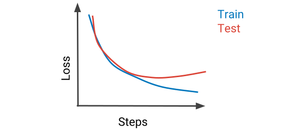

## Custom Training Loop

Wähle eines der ANNs aus dem Unterricht und

* experimentiere mit unterschiedlichen `batch`-sizes und halte deine Erkenntnisse fest
* bring das model zum Overfitten, die Kurven sollten etwa so aussehen:
  
* implementiere $l_2$-Regularisierung für alle Parameter des ANNs
    * `network.parameters()` returnt alle Parameter
    * Overfitting sollte nun geringer/weg sein
    * Adam hat hilfreiche Parameter
* implementiere folgende Funktionalität während des Trainings:
    * in regelmäßigen Abständen wird das gesamte Netzwerk gespeichert; wird das Training unterbrochen, so sollte beim
      letzten Checkpoint weitertrainiert werden
    * die letzten Parameter des ANNs müssen nicht unbedingt die besten sein. Stelle nach dem Training die besten
      Parameter wieder her